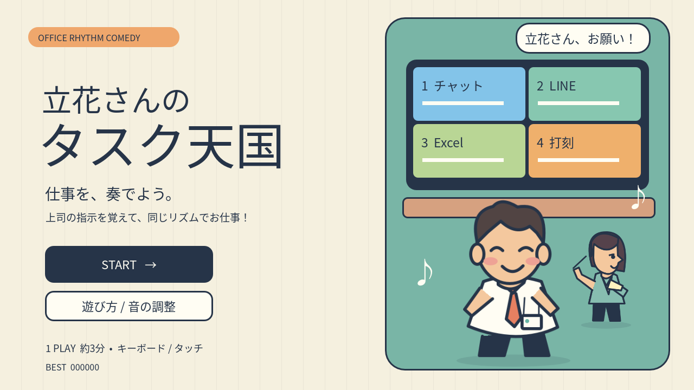

# 立花さんのタスク天国

Godotで制作したブラウザリズムゲーム。上司のお手本を覚えて、同じリズムでタスクを処理しよう！

**[ブラウザで遊ぶ](https://badgio0906.github.io/tachibana-task-heaven/)**



## 操作

| 業務 | PC | スマートフォン | 音 |
|---|---|---|---|
| チャット | 上段の1キー | 青の画面をタップ | タンバリン |
| LINE風メッセージ | 上段の2キー | 緑の画面をタップ | トライアングル |
| Excel風表計算 | 上段の3キー | 黄緑の画面をタップ | シンバル |
| 打刻 | 上段の4キー | オレンジの画面をタップ | バスドラム |

初回STARTで説明と練習に進みます。上司のお手本を聞き、「はい！」の後、同じ拍で入力してください。休符は押さずに待ちます。Escまたは右上のⅡで一時停止。音の調整はタイトルの「遊び方 / 音の調整」から。

スマートフォンは横向きで遊んでください。縦向きでは案内を表示して一時停止します。タブやウィンドウを離れたときも一時停止します。音声は操作後に開始します。

## ルール

- PERFECT（±90ms）100点、GOOD（±180ms）70点、OK（±280ms）40点、MISSは0点。
- 正解でコンボ増加・TASK +2.5%、MISSでコンボリセット・TASK -6%。TASKは40%から開始。
- 全3ステージ終了時にTASK 70%以上でクリア。累計15MISSで途中ゲームオーバー。
- STAGE 1：90 BPM / 51.93秒。STAGE 2：110 BPM / 54.60秒。STAGE 3：136 BPM / 53.10秒。
- 本編114ノート、最高11400点。練習約11秒とステージ間の操作を含めて約3分。
- 練習は本編の得点に含みません。成功後は本編へ、失敗時は練習を再挑戦できます。
- クリアでは褒められて「えへへ」、失敗するとカムチャッカ半島第2オフィスへ。

## プロジェクト

- Godot **4.5.1 stable** / GDScript / Compatibility renderer。
- `project.godot` をGodotで開いてF6ではなくF5で実行。
- 1280×720基準。横画面に合わせて比率を保って拡大縮小。
- 元のRing Survivorsとは独立したプロジェクト。既存ゲームのセーブやログを参照・変更しません。
- 保存先：このゲーム専用の `user://task_heaven.cfg`。練習済み、ハイスコア、音量、入力補正のみ。

## 変更しやすいファイル

| 変更したい項目 | ファイル |
|---|---|
| 譜面・休符・8分音符・問題の長さ | `data/stage_01.json` ～ `stage_03.json` の `rounds` |
| BPM | 同じステージJSONの `bpm` |
| 練習問題 | `data/tutorial.json` |
| 判定幅 | `data/settings.json` の `PERFECT_WINDOW` / `GOOD_WINDOW` / `OK_WINDOW`（秒） |
| 難易度・TASK増減・MISS上限 | `data/settings.json` と各ステージJSON |
| 判定と入力処理 | `scripts/rhythm_manager.gd` |
| スコア・コンボ | `scripts/score_manager.gd` |
| 画面構成とキャラクター演出 | `scripts/office_view.gd` / `scripts/task_screen.gd` |
| BGM・SE・SVGイラスト生成 | `tools/build_assets.py` |
| Web音声同期 | `web/audio.js` / `scripts/audio_manager.gd` |

各ノートは `beat`（拍）と `channel`（1〜4）。`length` はフレーズ全長、`rests` は休符の拍、最後の問題に `final: true` を設定します。

**譜面またはBPMを変更したら、音源も再生成してWebを再出力してください。** デモ音をBGMへ正確な時刻で埋め込むため、JSONだけを変えると音と譜面がずれます。

```powershell
python -m pip install numpy
python tools/build_assets.py
godot --headless --editor --import --quit
godot --headless --script tests/test_game.gd -- --verify
./tools/export.ps1
```

`build_assets.py` は既存のJSONを上書きしません。最初にだけ既定譜面を作成し、以降はJSONを読み込んで音源・オリジナル図版を再生成します。

## Web公開

`docs/` はGodotのリリースWeb出力です。スレッドを使わず、通常のHTTPSホスティングで動作します。`index.html` をファイルとしてダブルクリックせず、HTTPサーバーまたは公開URLから開いてください。

```powershell
python -m http.server 8766 --directory docs
```

WebではWeb Audio APIの音声クロックを基準に、BGM・お手本・譜面を同期。Godotデスクトップでは出力遅延を差し引いた単調クロックを使用します。再生時刻からノート時刻を判定し、連続Timerやフレーム数に依存しません。

`main` へのpushで `.github/workflows/deploy.yml` が `docs/` をGitHub Pagesへ公開します。ビルドは先に `tools/export.ps1` で実行し、出力もコミットしてください。リリース版にステージスキップ・強制クリア用の操作はありません。

検証記録は [VERIFICATION.md](VERIFICATION.md)、素材・ライセンスは [CREDITS.md](CREDITS.md) を参照してください。
